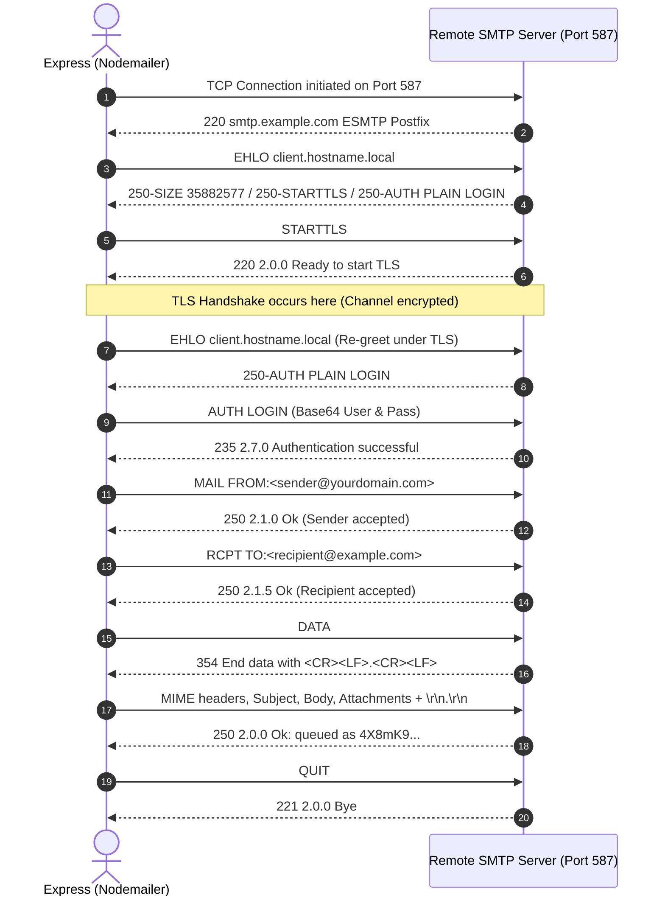

# SMTP & Nodemailer Learning Lab (with MSSQL, Auth & ImageKit)

A production-grade, educational Node.js backend project built for mastering **SMTP email delivery**, **Nodemailer architecture**, **JWT user authentication**, **MSSQL persistence with Sequelize**, and **defensive engineering**.

Built with:
* **Node.js (ESM - `"type": "module"` )**
* **Express 4** with **Helmet** & **CORS**
* **Nodemailer 6** (Connection pooling, timeouts, Ethereal auto-fallback)
* **Microsoft SQL Server** via **Sequelize ORM** & **msnodesqlv8** (Windows Trusted Auth)
* **Authentication**: **JWT (`jsonwebtoken`)** & **`bcryptjs`** password hashing
* **Rate Limiting**: **`express-rate-limit`** for brute-force & spam mitigation
* **Media Storage**: **ImageKit CDN** with in-memory **Multer** streaming
* **Nodemon** (Dev server with live reload)

---

## 1. Quick Start

### Installation

```bash
npm install
```

### Configuration

Copy `.env.example` to `.env`:

```bash
cp .env.example .env
```

> **Zero-Config Out-of-the-Box:**
> If you leave `SMTP_HOST` and `SMTP_USER` empty in `.env`, the lab automatically generates an ephemeral **Ethereal test inbox** on startup. Every email sent (welcome, password reset, or test emails) returns a clickable `previewUrl` directly in the JSON response!
> On startup, the server also checks for the database defined in `DATABASE=...` in your local SQL Server instance. If not found, it automatically creates it and synchronizes all tables (`Users`, `EmailLogs`).

### Run the Server

```bash
# Development mode with hot-reloading:
npm run dev

# Standard mode:
npm start
```

---

## 2. Architecture & Subsystems

```
smtp-nodemailer-lab/
├── src/
│   ├── config/
│   │   ├── database.js          # MSSQL auto-creation, pooling & Sequelize ORM
│   │   ├── imagekit.js          # ImageKit CDN SDK singleton
│   │   ├── jwt.js               # JWT signing & verification
│   │   └── mailer.js            # Nodemailer transport, pooling & Ethereal fallback
│   ├── controllers/
│   │   ├── auth.controller.js   # Register, verify-email, login, me, reset-password
│   │   └── email.controller.js  # Send text, html, template, attachment, bulk & logs
│   ├── middleware/
│   │   ├── asyncHandler.js      # Global async/await error forwarder
│   │   ├── auth.middleware.js   # authenticate (JWT), authorize (RBAC), optionalAuth
│   │   ├── errorHandler.js      # Standardized SMTP and HTTP error mapper
│   │   └── rateLimiter.js       # Auth, email, and API rate limiters
│   ├── models/
│   │   ├── EmailLog.js          # Audit schema for every email sent
│   │   ├── User.js              # User schema with bcrypt hooks and safe JSON
│   │   └── index.js             # Model associations and sync
│   ├── routes/
│   │   ├── auth.routes.js       # /api/auth
│   │   ├── email.routes.js      # /api/email
│   │   └── media.routes.js      # /api/media
│   ├── services/
│   │   └── emailService.js      # Core email dispatcher, template delivery & audit logs
│   ├── templates/
│   │   ├── authEmails.js        # Responsive verification and password reset templates
│   │   └── welcomeEmail.js      # Responsive HTML + multipart/alternative fallback
│   ├── utils/
│   │   └── validateEmailPayload.js # Strict RFC regex validator
│   ├── app.js                   # Unified Express application router
│   └── server.js                # Lifecycle, graceful shutdown & pre-boot checks
├── .env                         # Active configuration
├── .env.example                 # Documented template
├── package.json
└── README.md
```

---

## 3. How SMTP Actually Works Under the Hood

SMTP (Simple Mail Transfer Protocol - RFC 5321) is a stateful, line-oriented TCP protocol. Nodemailer abstracts these raw socket commands into clean JavaScript promises.



---

## 4. API Reference & Curl Examples

### Response Envelope
Every endpoint returns a predictable, standardized JSON envelope:
```json
{
  "success": true,
  "message": "Human-readable summary",
  "data": { ... },
  "meta": { "totalRecords": 25, "currentPage": 1, ... }
}
```

---

### A. System Telemetry & Dependency Probe (`/api/system`)

#### 1. Real-time System & Dependency Health
Probes live MSSQL query latency, SMTP transporter handshake, ImageKit readiness, Node process memory, and uptime.
```bash
curl -X GET http://localhost:3000/api/system/health
```

---

### B. Authentication & User Lifecycle (`/api/auth`)

#### 1. Register User & Dispatch Verification Email
Registers user, hashes password with bcryptjs, and sends an automated verification email via Nodemailer.
```bash
curl -X POST http://localhost:3000/api/auth/register \
  -H "Content-Type: application/json" \
  -d '{
    "name": "Jane Developer",
    "email": "jane@example.com",
    "password": "SecurePassword123!"
  }'
```

#### 2. Verify Email Address
Click the link in the verification email, or send the token via API:
```bash
curl -X POST http://localhost:3000/api/auth/verify-email \
  -H "Content-Type: application/json" \
  -d '{
    "token": "<32_BYTE_HEX_TOKEN>"
  }'
```

#### 3. Log In (Issues JWT)
```bash
curl -X POST http://localhost:3000/api/auth/login \
  -H "Content-Type: application/json" \
  -d '{
    "email": "jane@example.com",
    "password": "SecurePassword123!"
  }'
```

#### 4. Get Current User Profile (Protected)
```bash
curl -X GET http://localhost:3000/api/auth/me \
  -H "Authorization: Bearer <YOUR_JWT_TOKEN>"
```

#### 5. Request Password Reset Link
Generates reset token (1-hour expiry) and emails user via Nodemailer:
```bash
curl -X POST http://localhost:3000/api/auth/forgot-password \
  -H "Content-Type: application/json" \
  -d '{
    "email": "jane@example.com"
  }'
```

#### 6. Reset Password
```bash
curl -X POST http://localhost:3000/api/auth/reset-password \
  -H "Content-Type: application/json" \
  -d '{
    "token": "<RESET_TOKEN>",
    "newPassword": "BrandNewPassword123!"
  }'
```

---

### B. Email Sending & Audit Logs (`/api/email`)

*Note: You can optionally pass `Authorization: Bearer <token>` to any email endpoint; the email log in MSSQL will automatically associate with your user account.*

#### 1. Transporter Health Check
```bash
curl -X GET http://localhost:3000/api/email/health
```

#### 2. Query Email Audit Logs (from MSSQL)
```bash
curl -X GET "http://localhost:3000/api/email/logs?limit=10" \
  -H "Authorization: Bearer <OPTIONAL_TOKEN>"
```

#### 3. Send Plain Text Email
```bash
curl -X POST http://localhost:3000/api/email/send \
  -H "Content-Type: application/json" \
  -d '{
    "to": "client@example.com",
    "subject": "Plain Text Notification",
    "text": "Hello from Nodemailer!"
  }'
```

#### 4. Send Rich HTML Email (with Plaintext Fallback)
```bash
curl -X POST http://localhost:3000/api/email/send-html \
  -H "Content-Type: application/json" \
  -d '{
    "to": "client@example.com",
    "subject": "Monthly Report",
    "html": "<h1>Your Report</h1><p>All services are <strong>operational</strong>.</p>"
  }'
```

#### 5. Send Templated Welcome Email
```bash
curl -X POST http://localhost:3000/api/email/send-template \
  -H "Content-Type: application/json" \
  -d '{
    "to": "client@example.com",
    "name": "Jane Developer"
  }'
```

#### 6. Send Email with Attachment (Multipart)
```bash
echo "Sample file content" > test.txt

curl -X POST http://localhost:3000/api/email/send-attachment \
  -F "to=client@example.com" \
  -F "subject=Document Delivery" \
  -F "file=@test.txt"
```

#### 7. Concurrent Bulk Dispatch (Promise.allSettled)
```bash
curl -X POST http://localhost:3000/api/email/send-bulk \
  -H "Content-Type: application/json" \
  -d '{
    "to": ["user1@example.com", "user2@example.com"],
    "subject": "System Announcement",
    "text": "Important update for all accounts."
  }'
```

---

### C. Media Storage (`/api/media`)

#### 1. ImageKit Health Status
```bash
curl -X GET http://localhost:3000/api/media/health
```

#### 2. Upload Media to ImageKit CDN
```bash
curl -X POST http://localhost:3000/api/media/upload \
  -F "file=@sample.png" \
  -F "folder=/user-avatars"
```

---

## 5. Security & Deliverability Highlights

1. **Password Safety**: Salted bcrypt password hashing with 12 rounds. Passwords and internal reset tokens are never exposed in JSON responses.
2. **Anti-Enumeration**: `/login` and `/forgot-password` return generic responses to prevent attackers from determining which email addresses exist.
3. **Spam Mitigation**: All HTML emails automatically generate a plain-text alternative (`multipart/alternative`), preserving high deliverability in SpamAssassin and Google Postmaster.
4. **Rate Limiting**: Rate limiters shield `/login`, `/register`, and `/forgot-password` from brute-force dictionary attacks, while `/send` endpoints are throttled to protect SMTP quotas.
5. **MSSQL Audit Trail**: Every email transaction (status, message ID, provider response, preview URL) is persisted in the `EmailLogs` table.
